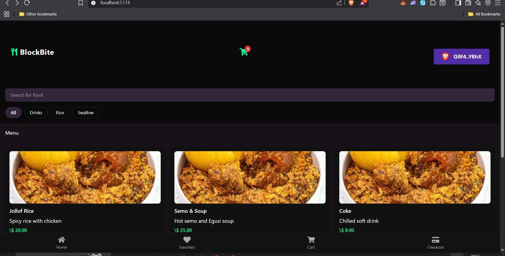

# 🍴 Blockbite

A decentralized food ordering and checkout system powered by **Solana Pay**, built with **Anchor**, **React**, and **Express**.  

---

## ✨ Features

- 🚀 **Seamless Checkout** with Solana Pay  
- 🛒 **Food Ordering Flow**: browse items, add to cart, checkout  
- 🔒 **Secure Transactions** using Anchor smart contracts  
- ⚡ **Fast Settlement** via Solana blockchain  

---

## 📸 Screenshots

  


  

---

## 🛠️ Tech Stack

- **Frontend:** React + Vite  
- **Backend:** Express.js  
- **Smart Contracts:** Anchor (Solana Program Library)  
- **Payments:** Solana Pay SDK  

---

## ⚙️ Installation & Setup

### Prerequisites
- Node.js (v18+)  
- Yarn or npm  
- Solana CLI & Anchor CLI installed  
- Phantom or Solflare wallet  

### Steps

1. **Clone the repo**
   ```bash
   git clone https://github.com/sege2023/solana-food-ordering.git
   git checkout blockbite-proto
   # frontend
    cd ui
    npm install
    npm run dev
    
    # backend
    cd blockbite-backend
    npm install
    npm run dev
    
    # smart contracts
     git checkout main
     cd blockbite
   
    cd smart-contracts/onchain/programs
    anchor build
    anchor deploy
     
    


